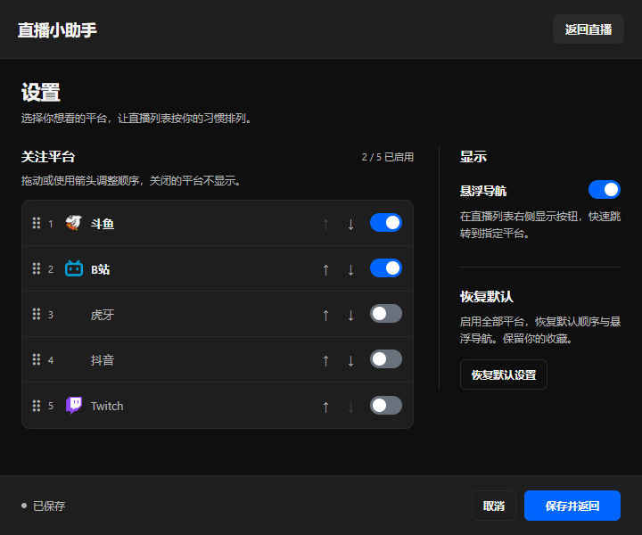

# Live Assistant · EricWang fork

[中文](README.md)

A Chrome extension developed and maintained by **EricWang**, bringing followed streams from multiple platforms into one popup.

This is an independently maintained, unofficial fork of [Live-Assistant](https://github.com/L1cardo/Live-Assistant) by **Licardo (L1cardo)**. Thank you to the original author and upstream contributors for making the project available as free software. This fork remains licensed under **GPLv3** and retains upstream attribution; see [NOTICE.md](NOTICE.md).

Version: **1.3.4**. Upstream base: `v1.3.3` (`8b282d1`). Modification date: **2026-10-05**.

[Download](https://github.com/Feeengyuuu/Live-Assistant/releases/latest) · [Release notes](docs/releases/v1.3.4.md) · [Report an issue](https://github.com/Feeengyuuu/Live-Assistant/issues)

Settings preview with example preferences:



## 🌟 Features

- Live status, viewer counts or platform popularity metrics updated when opening the popup or refreshing.
- Results appear as each platform responds, without waiting for slower platforms.
- Last successful results are retained per platform, with clear refresh failure and incomplete-list notices.
- Open a stream from its card; favorites move to the top immediately without another follow-list request.
- Customize platform order, enabled platforms and floating buttons, with light/dark themes following the system.
- Fixed 720 × 600 popup with three columns of preview cards.
- A compact two-column offline list below live streams, collapsed by default and loaded on demand, with room links, favorites and available last-live records.

## 📦 Supported platforms

| Platform | Live list and previews | Offline list |
|----------|--------|--------|
| Douyu | Paginated follow list, live status, popularity metrics and additional live snapshots | Explicit offline records from the same follow pages |
| Huya | Paginated follow list, live status, popularity metrics and provider previews | Explicit offline records from the same follow pages |
| Bilibili | Followed live streams, viewer counts and additional live keyframes | Official live-follow directory loaded independently as needed when expanded |
| Douyin | Follow list, live status, viewer counts and provider previews | No reliable source verified yet |
| Twitch | Followed live streams, viewer counts and live previews | No reliable source verified yet |

These capabilities depend on platform login and API availability; they do not guarantee availability for every account. Images are static snapshots or covers supplied by the platforms and may be delayed.

## 🚀 Installation and updates

### Install this fork

1. Download `live-assistant-1.3.4.zip` from [this repository's Releases](https://github.com/Feeengyuuu/Live-Assistant/releases).
2. Extract it to a folder you intend to keep.
3. Open `chrome://extensions/`, enable **Developer mode**, select **Load unpacked**, and choose the folder containing `manifest.json`.

This fork is distributed through GitHub. The original author's [Chrome store listing](https://chromewebstore.google.com/detail/gapakkgfjmmbdgaabgedecdhnpheboln) and [Edge store listing](https://microsoftedge.microsoft.com/addons/detail/iccpkamhcodiboccdihoimjaeoooflhk) are upstream products and do not include this fork's changes.

### Load local source

1. Download or clone [this repository's enhanced branch](https://github.com/Feeengyuuu/Live-Assistant/tree/enhanced).
2. Open `chrome://extensions/` and enable **Developer mode**.
3. Choose **Load unpacked** and select the project root containing `manifest.json`.

To update an existing unpacked installation, update the source in the same directory and click **Reload** on its existing extension entry. Keeping that entry preserves its local settings and favorites. Running the extension requires neither Node.js nor npm dependencies.

## 🔧 Usage

1. Log in to the streaming platforms you want to use, then open the extension popup.
2. Cached results appear first; enabled platforms update as needed and render as each response arrives.
3. Click a card to open the stream, or click its star to favorite it.
4. When needed, click **Offline** (未开播) below live streams to expand the list. Each new popup starts collapsed. Each section puts favorites first; live and offline entries share favorite state.
5. Use the two-column **Settings** panel to change platform order, enabled platforms and floating buttons. Choose **Save and return** (保存并返回) in the fixed footer to apply the draft, or **Cancel** (取消) to discard unsaved changes.

**Restore default settings** (恢复默认设置) only resets the current draft to the default platform order, all platforms enabled and default floating navigation. It takes effect after saving and preserves favorites and cached follow lists.

Successful results can be reused for 60 seconds. **Refresh** requests updates from enabled platforms. It refreshes the main lists while Offline is collapsed, and also requests independent offline supplements when expanded. Network failures and incomplete lists retain the last complete result with a status notice; confirmed login failures clear that platform's old list and show its login link. Updates happen on popup opening and manual refresh, without continuous polling.

Douyu previews prefer live snapshots and Bilibili previews prefer live keyframes. An available cover is used when no snapshot is available or when the snapshot image fails to load. See the [UI guide (Chinese)](UI-UPGRADE-GUIDE.md) for details.

### Offline lists and last-live records

To keep everyday use responsive, Offline starts collapsed and its expanded state is not saved. While collapsed, it makes no Bilibili auxiliary-directory requests and does not create or redraw offline rows. Expanding uses available data first, then fetches Bilibili's supplement as needed. Douyu and Huya reuse their main follow-list results without additional requests.

Only records explicitly marked offline by a platform appear in this list. Absence from the live list, request failure and missing authentication are not evidence of being offline. Coverage is limited to the supported live-follow sources, rather than every account followed on each platform; summary avatars do not create inferred room entries. Bilibili's independent request stays within 20 pages and a shared 10-second deadline, so longer lists may remain partial. Failed or incomplete updates retain a previous complete list with a notice; the extension does not keep adding requests to exhaust a directory. A successful live refresh does not make the offline list fresh.

- **Last started** (上次开播): a valid start time supplied by the platform, currently from Douyu records.
- **Last live** (上次直播): a valid live-record timestamp supplied by the platform, currently from Bilibili; it does not establish an exact start or end time.
- **Last seen live** (最近看到直播): the local time when the extension observed the broadcaster live during a complete, successful refresh. It does not establish when that stream started or ended.
- **No record** (暂无记录): neither a valid platform timestamp nor a usable local observation is available, including when the provider returns an empty value or zero. The extension does not make bulk room requests to infer past broadcasts.

Dates use the browser's local timezone. The extension does not continue recording while the popup is closed. Local observations retain up to 1,000 broadcasters for 180 days. See the [API evidence notes (Chinese)](docs/offline-api-evidence.md) for sources and pagination limits.

## 📁 Project structure

```text
Live-Assistant/
├── src/
│   ├── background.js     # Live/offline requests, pagination and error classification
│   ├── thumbnails.js     # Douyu/Bilibili snapshot retrieval and caching
│   ├── popup.html        # Popup structure and styles
│   └── popup.js          # Progressive updates, separate caches, observations and settings
├── docs/                 # Offline API and timestamp evidence notes
├── scripts/              # Static and release version checks
├── tests/                # Node regressions and optional browser tests
├── package.json          # Development commands; no runtime dependencies
├── icon.png              # Extension icon
├── manifest.json         # Manifest V3 extension configuration
├── README.md
└── LICENSE
```

## 🧪 Development checks

The extension uses native JavaScript, HTML/CSS and Chrome Extension APIs. Use **Node.js 20 or later** for development checks and run these commands from the project root:

```sh
npm run check
npm test
npm run package
```

These commands do not need `npm install`. `check` validates syntax and extension entry files; `test` runs regressions; `package` runs both before producing `dist/live-assistant-1.3.4.zip` and its SHA-256 file. Packaging uses an explicit allowlist of runtime source, icon, manifest, the complete LICENSE and NOTICE. Local backups and browser verification data are excluded. Optional browser tests use Playwright with mocked data; see the [contribution guide (Chinese)](CONTRIBUTING.md#开发和测试) for setup. Passing mocked tests does not establish that every platform works with a real account.

## ⚠️ Data and freshness

Settings, favorites, follow-list caches and last-seen-live observations are stored in extension local storage; requests use the platform's login state for authentication. Live and offline lists track retrieval status and successful update times separately. Retained results may be out of date, so check platform and list-coverage notices. API changes or rate limits can affect data retrieval.

## 🤝 Contributing

Issues and pull requests are welcome. Read the [contribution guide (Chinese)](CONTRIBUTING.md), make changes on your own branch and run the checks before submitting a PR.

## 📄 License

This derivative remains licensed under GPLv3. See [LICENSE](LICENSE) and [NOTICE.md](NOTICE.md). The release contains editable runtime source; the matching tagged source archive also includes development tests and packaging scripts.

## 👨‍💻 Developer

**EricWang** — Developer and maintainer of this fork. [GitHub: Feeengyuuu](https://github.com/Feeengyuuu).

## 🙏 Acknowledgments

Thank you to **Licardo (L1cardo)** for creating and releasing [Live-Assistant](https://github.com/L1cardo/Live-Assistant), and to all upstream contributors. The original project provides the multi-platform foundation; this fork maintains the performance work, redesigned settings, live-frame fixes, optional offline information and independent releases. Please report issues with this fork in this repository.

*If you find this project useful, please give it a Star!*
